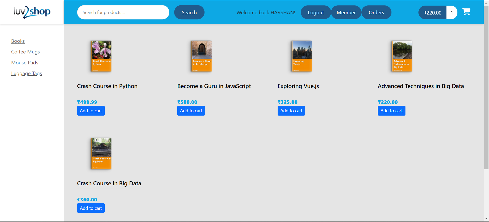

# Full Stack E-Commerce Website with Angular and Spring Boot

<h2>Project Screenshots:</h2>
<h3>Desktop view</h3>

Welcome to the repository housing the code for the Full Stack E-Commerce Website developed as part of the Udemy course ["Full Stack: Angular and Java Spring Boot E-Commerce Website"](https://www.udemy.com/course/full-stack-angular-spring-boot-tutorial/) by [Chad Darby](https://github.com/darbyluv2code). The project leverages various technologies, including Java 17, Apache Maven, Hibernate, Spring Core, Spring Data, Spring REST, Spring Boot, Spring Security, TypeScript, Angular, Auth0, Stripe, and Postman API.

## Overview

Named "Luv2Shop," this E-Commerce website is a comprehensive application crafted with Angular and Java Spring Boot. It encompasses a rich set of features essential for a contemporary online store. The project serves as a showcase of best practices in constructing robust and secure web applications utilizing the aforementioned technologies.

## Features

- **User Authentication**: Implements Spring Security and Auth0 for secure user authentication and authorization.
  
- **Product Catalog**: Facilitates user-friendly browsing and searching within a well-organized product catalog.
  
- **Shopping Cart**:  Enables users to seamlessly add products to their carts and proceed to checkout.
  
- **Payment Integration**: Integrates with Stripe for secure and efficient payment handling.
  
- **Postman API Documentation**: Detailed API documentation using Postman.

- **Responsive Design**: Prioritizes enhanced styling and responsive design for an optimal user experience.

- **Hosting**: The frontend, backend, and database are all hosted on AWS for accessibility.

## Technologies Used

- Java 17
- Apache Maven
- Hibernate
- Spring Core
- Spring Data
- Spring REST
- Spring Boot
- Spring Security
- TypeScript
- Angular
- Auth0
- Stripe
- Postman API

## Contributions

### Added Postman API Documentation

I contributed by implementing Postman API documentation to provide detailed information on the project's API endpoints. This documentation can be accessed at [Postman API Documentation](https://luv2shop.shop/api/).

### Refine Styling and Responsive Design

Worked on enhancing the user interface by refining styling and ensuring responsive design for an improved visual experience.

### Frontend Hosting on AWS

The frontend of the project is hosted on AWS S3 Bucket for easy access.

### Backend Hosting on AWS

The backend of the project is hosted on AWS EC3 Service.

### MySQL Database Hosting on AWS

The MySQL database is hosted on AWS RDS Service.

## Usage

To maximize your experience with the Luv2Shop website, follow these steps:

1. **Browse the Product Catalog:**

   - Explore available products without logging in.

2. **Login to Your Account:**

   - Sign in using your Google account or create a new account.

3. **Access Additional Features with Login:**

   - Logging in provides access to more sections of the website, such as:
     - Member: Profile information.
     - Orders: View your order history.

4. **Add Items to Your Cart:**

   - Click "Add to Cart" for desired products.
   - Review and modify your shopping cart at any time.

5. **Proceed to Checkout:**

   - Once you've added all the desired items to your cart, proceed to checkout.
   - Provide the necessary shipping and billing information.
   - Review your order to ensure it's accurate.

6. **Make a Payment Using Stripe:**

   For testing, use the provided Stripe test card details.
   - American expressTest Card: 3782 8224 6310 005
   - Card Number: 4242 4242 4242 4242
   - Expiration Date: Any future date (e.g., 12/25)
   - CVC: Any three-digit number (e.g., 123)

   These test card details simulate a successful payment and allow you to test the payment functionality without making actual charges to a credit card.

7. **Order Confirmation and Tracking:**
   - After successfully placing your order, a confirmation popup will appear.
   - Additionally, you can access the "Orders" section in your account to view all your orders.

## Demo

You can preview Luv2Shop live demo at [luv2shop-ecommerce](https://luv2shop.site). The demo provides a hands-on experience of the website's features and functionality.

## Video Demonstration

Watch a video demonstration of the Luv2Shop project [here](https://www.youtube.com/watch?v=jLlTbAgyTbQ).

## Contact Information

If you have any questions, suggestions, or just want to get in touch, you can reach us at:

- Email: [harshan2602@gmail.com](mailto:harshan2602@gmail.com)
- LinkedIn: [Harshan Selvakumar](https://www.linkedin.com/in/harshan2602/)

I appreciate your interest and look forward to your contributions and feedback!
